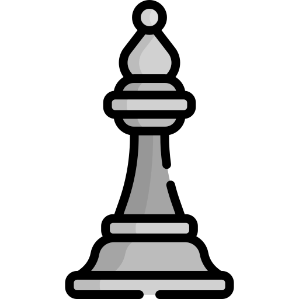
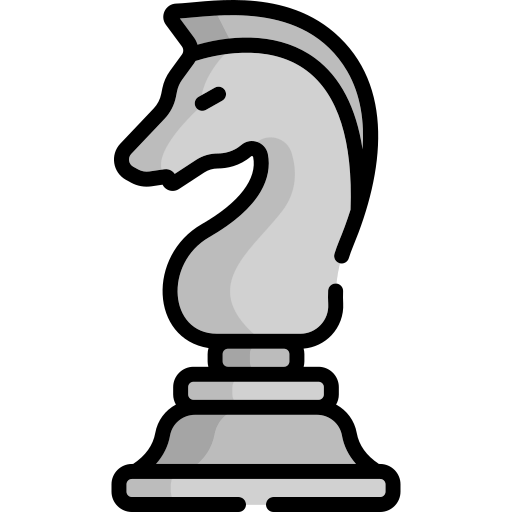

# Hey there! I'm Mouhieddine
<h1> ♟ &nbsp;Chess Tournament </h3>

This is an open chess tournament where ANYONE can play. That's the fun part.  
It's your turn to play! Move a <!-- BEGIN TURN -->black<!-- END TURN --> piece.

<!-- BEGIN CHESS BOARD -->
|   | A | B | C | D | E | F | G | H |   |
|---|:-:|:-:|:-:|:-:|:-:|:-:|:-:|:-:|:-:|
| **8** |  |  |  |  |  |  |  |  | **8** |
| **7** |  |  |  |  |  |  |  |  | **7** |
| **6** |  |  |  |  |  |  |  |  | **6** |
| **5** |  |  |  |  |  |  |  |  | **5** |
| **4** |  |  |  |  |  |  |  |  | **4** |
| **3** |  |  |  |  |  |  |  |  | **3** |
| **2** |  |  |  |  |  |  |  |  | **2** |
| **1** |  |  |  |  |  |  |  |  | **1** |
|   | **A** | **B** | **C** | **D** | **E** | **F** | **G** | **H** |   |
<!-- END CHESS BOARD -->

**It's your turn to move! Choose one from the following table**
<!-- BEGIN MOVES LIST -->
|  FROM  | TO (Just click a link!) |
| :----: | :---------------------- |
| **A4** | [A3](https://github.com/BIRSAx2/BIRSAx2/issues/new?title=Chess%3A+Move+A4+to+A3&body=Please+do+not+change+the+title.+Just+click+%22Submit+new+issue%22.+You+don%27t+need+to+do+anything+else+%3AD) |
| **A8** | [A5](https://github.com/BIRSAx2/BIRSAx2/issues/new?title=Chess%3A+Move+A8+to+A5&body=Please+do+not+change+the+title.+Just+click+%22Submit+new+issue%22.+You+don%27t+need+to+do+anything+else+%3AD), [A6](https://github.com/BIRSAx2/BIRSAx2/issues/new?title=Chess%3A+Move+A8+to+A6&body=Please+do+not+change+the+title.+Just+click+%22Submit+new+issue%22.+You+don%27t+need+to+do+anything+else+%3AD), [A7](https://github.com/BIRSAx2/BIRSAx2/issues/new?title=Chess%3A+Move+A8+to+A7&body=Please+do+not+change+the+title.+Just+click+%22Submit+new+issue%22.+You+don%27t+need+to+do+anything+else+%3AD) |
| **B7** | [B5](https://github.com/BIRSAx2/BIRSAx2/issues/new?title=Chess%3A+Move+B7+to+B5&body=Please+do+not+change+the+title.+Just+click+%22Submit+new+issue%22.+You+don%27t+need+to+do+anything+else+%3AD), [B6](https://github.com/BIRSAx2/BIRSAx2/issues/new?title=Chess%3A+Move+B7+to+B6&body=Please+do+not+change+the+title.+Just+click+%22Submit+new+issue%22.+You+don%27t+need+to+do+anything+else+%3AD) |
| **B8** | [A6](https://github.com/BIRSAx2/BIRSAx2/issues/new?title=Chess%3A+Move+B8+to+A6&body=Please+do+not+change+the+title.+Just+click+%22Submit+new+issue%22.+You+don%27t+need+to+do+anything+else+%3AD), [C6](https://github.com/BIRSAx2/BIRSAx2/issues/new?title=Chess%3A+Move+B8+to+C6&body=Please+do+not+change+the+title.+Just+click+%22Submit+new+issue%22.+You+don%27t+need+to+do+anything+else+%3AD) |
| **C7** | [C5](https://github.com/BIRSAx2/BIRSAx2/issues/new?title=Chess%3A+Move+C7+to+C5&body=Please+do+not+change+the+title.+Just+click+%22Submit+new+issue%22.+You+don%27t+need+to+do+anything+else+%3AD), [C6](https://github.com/BIRSAx2/BIRSAx2/issues/new?title=Chess%3A+Move+C7+to+C6&body=Please+do+not+change+the+title.+Just+click+%22Submit+new+issue%22.+You+don%27t+need+to+do+anything+else+%3AD) |
| **D7** | [D5](https://github.com/BIRSAx2/BIRSAx2/issues/new?title=Chess%3A+Move+D7+to+D5&body=Please+do+not+change+the+title.+Just+click+%22Submit+new+issue%22.+You+don%27t+need+to+do+anything+else+%3AD), [D6](https://github.com/BIRSAx2/BIRSAx2/issues/new?title=Chess%3A+Move+D7+to+D6&body=Please+do+not+change+the+title.+Just+click+%22Submit+new+issue%22.+You+don%27t+need+to+do+anything+else+%3AD) |
| **E7** | [E5](https://github.com/BIRSAx2/BIRSAx2/issues/new?title=Chess%3A+Move+E7+to+E5&body=Please+do+not+change+the+title.+Just+click+%22Submit+new+issue%22.+You+don%27t+need+to+do+anything+else+%3AD), [E6](https://github.com/BIRSAx2/BIRSAx2/issues/new?title=Chess%3A+Move+E7+to+E6&body=Please+do+not+change+the+title.+Just+click+%22Submit+new+issue%22.+You+don%27t+need+to+do+anything+else+%3AD) |
| **F7** | [F5](https://github.com/BIRSAx2/BIRSAx2/issues/new?title=Chess%3A+Move+F7+to+F5&body=Please+do+not+change+the+title.+Just+click+%22Submit+new+issue%22.+You+don%27t+need+to+do+anything+else+%3AD), [F6](https://github.com/BIRSAx2/BIRSAx2/issues/new?title=Chess%3A+Move+F7+to+F6&body=Please+do+not+change+the+title.+Just+click+%22Submit+new+issue%22.+You+don%27t+need+to+do+anything+else+%3AD) |
| **G7** | [G6](https://github.com/BIRSAx2/BIRSAx2/issues/new?title=Chess%3A+Move+G7+to+G6&body=Please+do+not+change+the+title.+Just+click+%22Submit+new+issue%22.+You+don%27t+need+to+do+anything+else+%3AD) |
| **H5** | [F4](https://github.com/BIRSAx2/BIRSAx2/issues/new?title=Chess%3A+Move+H5+to+F4&body=Please+do+not+change+the+title.+Just+click+%22Submit+new+issue%22.+You+don%27t+need+to+do+anything+else+%3AD), [F6](https://github.com/BIRSAx2/BIRSAx2/issues/new?title=Chess%3A+Move+H5+to+F6&body=Please+do+not+change+the+title.+Just+click+%22Submit+new+issue%22.+You+don%27t+need+to+do+anything+else+%3AD), [G3](https://github.com/BIRSAx2/BIRSAx2/issues/new?title=Chess%3A+Move+H5+to+G3&body=Please+do+not+change+the+title.+Just+click+%22Submit+new+issue%22.+You+don%27t+need+to+do+anything+else+%3AD) |
| **H7** | [H6](https://github.com/BIRSAx2/BIRSAx2/issues/new?title=Chess%3A+Move+H7+to+H6&body=Please+do+not+change+the+title.+Just+click+%22Submit+new+issue%22.+You+don%27t+need+to+do+anything+else+%3AD) |
| **H8** | [G8](https://github.com/BIRSAx2/BIRSAx2/issues/new?title=Chess%3A+Move+H8+to+G8&body=Please+do+not+change+the+title.+Just+click+%22Submit+new+issue%22.+You+don%27t+need+to+do+anything+else+%3AD) |
<!-- END MOVES LIST -->

Having fun? Ask a friend to do the next move!

### How it works

When you click on a link and submit a new issue with the desired move, a GitHub action is triggered, which in turn runs a small python script that performs the specified movement, updates this README file and commits the changes.

  
Last 5 moves in this game

<!-- BEGIN LAST MOVES -->

| Move | Author |
| :--: | :----- |
| `C1` to `G5` | [ @jacopo-angeli](https://github.com/jacopo-angeli) |
| `A5` to `A4` | [ @antoniotangaro](https://github.com/antoniotangaro) |
| `E2` to `E4` | [ @BIRSAx2](https://github.com/BIRSAx2) |
| `A7` to `A5` | [ @antoniotangaro](https://github.com/antoniotangaro) |
| `D2` to `D4` | [ @BIRSAx2](https://github.com/BIRSAx2) |

<!-- END LAST MOVES -->

  
Top 10 most moves across all games

<!-- BEGIN TOP MOVES -->

| Total moves |  User  |
| :---------: | :----- |
| 4 | [@BIRSAx2](https://github.com/BIRSAx2) |
| 2 | [@antoniotangaro](https://github.com/antoniotangaro) |
| 1 | [@Dutta78](https://github.com/Dutta78) |
| 1 | [@imAlessas](https://github.com/imAlessas) |
| 1 | [@jacopo-angeli](https://github.com/jacopo-angeli) |

<!-- END TOP MOVES -->

 
<h1> 👨🏻‍💻 &nbsp;About Me </h3>

- 🤔 &nbsp; Exploring new technologies and developing software solutions and quick hacks.
- 🎓 &nbsp; Studying Computer Engineering at Università di Padova.
- 🌱 &nbsp; Learning more about Cloud Architecture, Systems Design and Artificial Intelligence.

<h1> 🛠 &nbsp;Tech Stack</h3>

- 💻 &nbsp;
  
  
  
  
  
  
- 🌐 &nbsp;
  
  
  
  
  
  
  
  
- 🛢 &nbsp;
  
- ⚙️ &nbsp;
  
  
  
  
  
- 🔧 &nbsp;
  
  
- 🖥 &nbsp;
  
  
 

 

<h1> 🤝🏻 &nbsp;Connect with Me </h3>

