

  

 

  
  &nbsp;
  
  &nbsp;
  

 

---

### 👨🏻‍💻 &nbsp;About

Backend Engineer at **MultiSafepay** working on payment infrastructure, transaction flows, event-driven pipelines, and financial reconciliation.
Currently pursuing an **MSc in Computer Science** at Aarhus University, specialising in Software Foundations & Technology.
I gravitate toward systems programming, distributed systems, compilers, and type theory.

> 🌐 **Full portfolio & interactive CV at [mouhieddine.dev](https://mouhieddine.dev)**

---

### 🚀 &nbsp;Featured Projects

<table>
  <tr>
    <td width="50%">
      <h4><a href="https://github.com/BIRSAx2/tiny-redis">🗄️ tiny-redis</a></h4>
      Redis-compatible server from scratch, RESP2 protocol, all 5 data structures, MULTI/EXEC transactions, AOF persistence, 5 eviction policies.
        
      
      
    </td>
    <td width="50%">
      <h4><a href="https://github.com/BIRSAx2/dolphin">🐬 dolphin</a></h4>
      Full-pipeline compiler for a statically-typed language, Menhir parser, type inference, LLVM IR codegen, C runtime with networking.
        
      
      
    </td>
  </tr>
  <tr>
    <td width="50%">
      <h4><a href="https://github.com/BIRSAx2/CoqHM">🔬 CoqHM</a></h4>
      Formal verification of Hindley-Milner type inference proved sound in the Rocq proof assistant.
        
      
      
    </td>
    <td width="50%">
      <h4><a href="https://github.com/BIRSAx2/ibn-battuta">🗺️ ibn-battuta</a></h4>
      TSP solver library, exact (BHK, B&B), heuristic (2-Opt, LK), and metaheuristic (ACS, GA, SA) algorithms. Published on crates.io.
        
      
      
    </td>
  </tr>
  <tr>
    <td width="50%">
      <h4><a href="https://github.com/BIRSAx2/random-art">🎨 random-art</a></h4>
      Procedural abstract art via recursive expression grammars, renders to PNG or real-time GLSL shaders.
        
      
      
    </td>
  </tr>
</table>

---

### 🛠 &nbsp;Tech Stack

**Languages**

**Java Ecosystem**

**Rust Ecosystem**

**Databases**

**Infrastructure & Observability**

**Tooling**

---

### 📊 &nbsp;Stats

  

  
  &nbsp;
  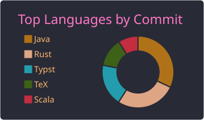

  
  &nbsp;
  

---

### ♟️ &nbsp;Chess Tournament

This is an open chess tournament where ANYONE can play. That's the fun part.
It's your turn to play! Move a <!-- BEGIN TURN -->black<!-- END TURN --> piece.

<!-- BEGIN CHESS BOARD -->
|   | A | B | C | D | E | F | G | H |   |
|---|:-:|:-:|:-:|:-:|:-:|:-:|:-:|:-:|:-:|
| **8** | 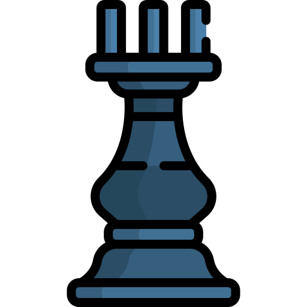 |  | 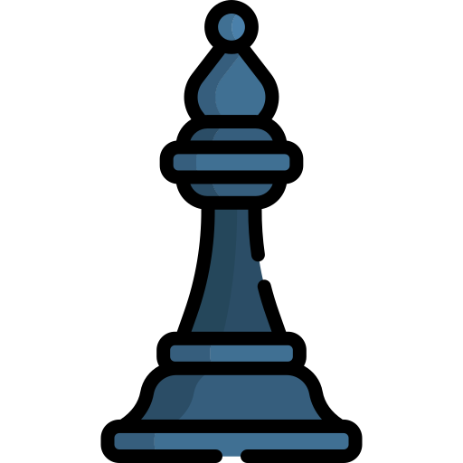 | 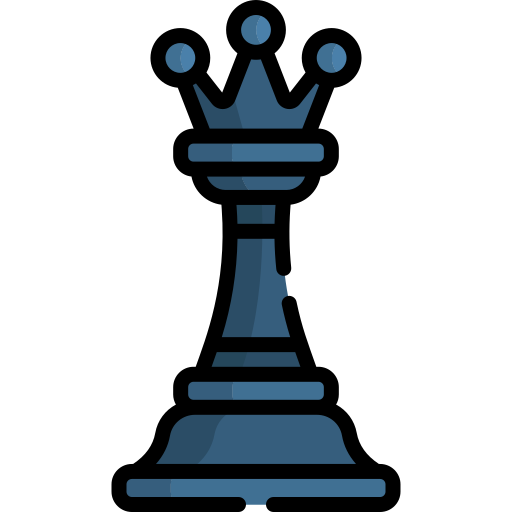 |  |  |  |  | **8** |
| **7** |  | 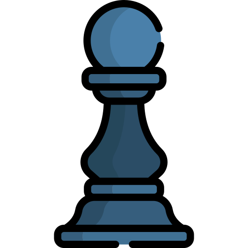 |  |  |  | 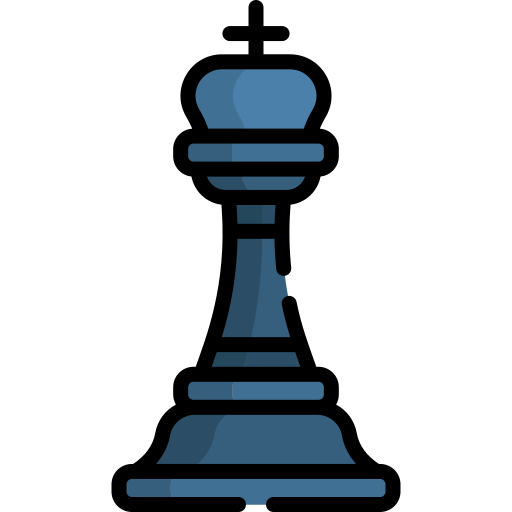 |  |  | **7** |
| **6** |  |  |  |  |  |  |  |  | **6** |
| **5** |  |  |  |  |  |  | 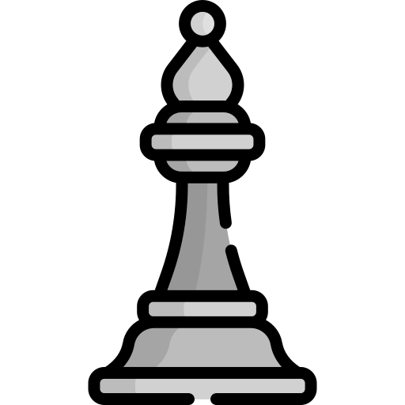 |  | **5** |
| **4** |  |  |  | 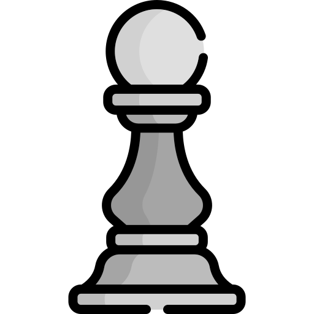 |  |  |  |  | **4** |
| **3** |  |  | 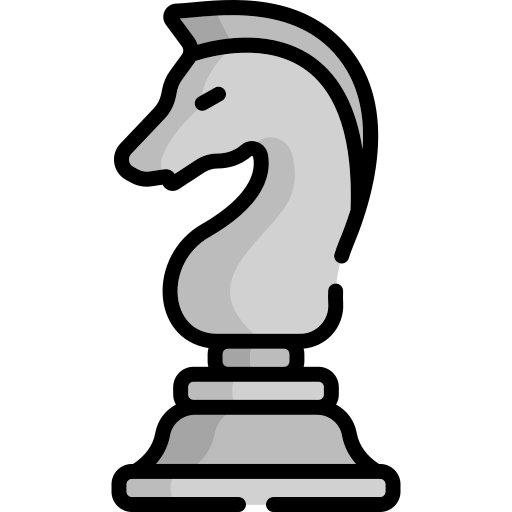 |  |  |  |  |  | **3** |
| **2** |  |  |  |  |  |  |  |  | **2** |
| **1** | 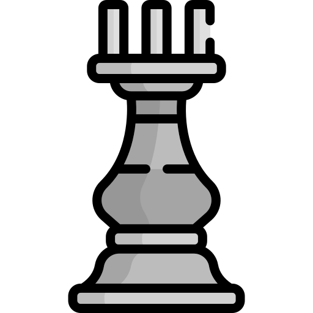 |  |  | 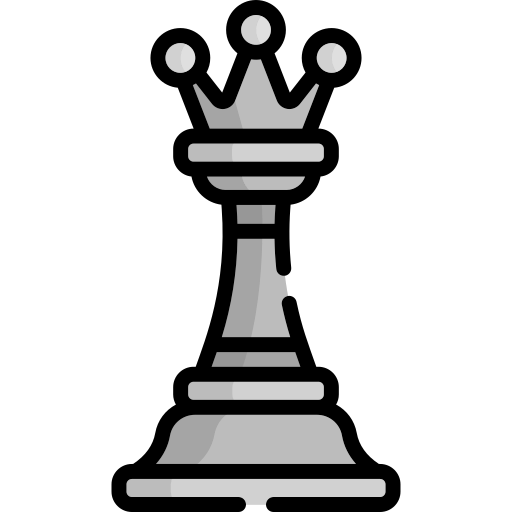 | 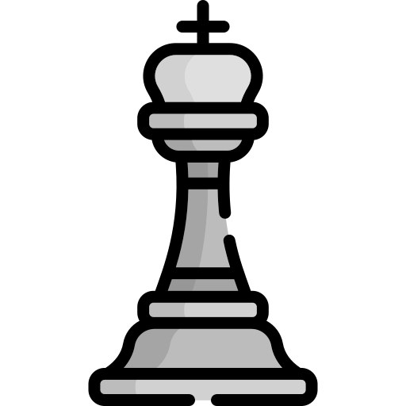 |  |  |  | **1** |
|   | **A** | **B** | **C** | **D** | **E** | **F** | **G** | **H** |   |
<!-- END CHESS BOARD -->

**It's your turn to move! Choose one from the following table**
<!-- BEGIN MOVES LIST -->
|  FROM  | TO (Just click a link!) |
| :----: | :---------------------- |
| **A3** | [B2](https://github.com/BIRSAx2/BIRSAx2/issues/new?title=Chess%3A+Move+A3+to+B2&body=Please+do+not+change+the+title.+Just+click+%22Submit+new+issue%22.+You+don%27t+need+to+do+anything+else+%3AD) |
| **A8** | [A4](https://github.com/BIRSAx2/BIRSAx2/issues/new?title=Chess%3A+Move+A8+to+A4&body=Please+do+not+change+the+title.+Just+click+%22Submit+new+issue%22.+You+don%27t+need+to+do+anything+else+%3AD), [A5](https://github.com/BIRSAx2/BIRSAx2/issues/new?title=Chess%3A+Move+A8+to+A5&body=Please+do+not+change+the+title.+Just+click+%22Submit+new+issue%22.+You+don%27t+need+to+do+anything+else+%3AD), [A6](https://github.com/BIRSAx2/BIRSAx2/issues/new?title=Chess%3A+Move+A8+to+A6&body=Please+do+not+change+the+title.+Just+click+%22Submit+new+issue%22.+You+don%27t+need+to+do+anything+else+%3AD), [A7](https://github.com/BIRSAx2/BIRSAx2/issues/new?title=Chess%3A+Move+A8+to+A7&body=Please+do+not+change+the+title.+Just+click+%22Submit+new+issue%22.+You+don%27t+need+to+do+anything+else+%3AD) |
| **B7** | [B5](https://github.com/BIRSAx2/BIRSAx2/issues/new?title=Chess%3A+Move+B7+to+B5&body=Please+do+not+change+the+title.+Just+click+%22Submit+new+issue%22.+You+don%27t+need+to+do+anything+else+%3AD), [B6](https://github.com/BIRSAx2/BIRSAx2/issues/new?title=Chess%3A+Move+B7+to+B6&body=Please+do+not+change+the+title.+Just+click+%22Submit+new+issue%22.+You+don%27t+need+to+do+anything+else+%3AD) |
| **B8** | [A6](https://github.com/BIRSAx2/BIRSAx2/issues/new?title=Chess%3A+Move+B8+to+A6&body=Please+do+not+change+the+title.+Just+click+%22Submit+new+issue%22.+You+don%27t+need+to+do+anything+else+%3AD), [C6](https://github.com/BIRSAx2/BIRSAx2/issues/new?title=Chess%3A+Move+B8+to+C6&body=Please+do+not+change+the+title.+Just+click+%22Submit+new+issue%22.+You+don%27t+need+to+do+anything+else+%3AD) |
| **C7** | [C5](https://github.com/BIRSAx2/BIRSAx2/issues/new?title=Chess%3A+Move+C7+to+C5&body=Please+do+not+change+the+title.+Just+click+%22Submit+new+issue%22.+You+don%27t+need+to+do+anything+else+%3AD), [C6](https://github.com/BIRSAx2/BIRSAx2/issues/new?title=Chess%3A+Move+C7+to+C6&body=Please+do+not+change+the+title.+Just+click+%22Submit+new+issue%22.+You+don%27t+need+to+do+anything+else+%3AD) |
| **D7** | [D5](https://github.com/BIRSAx2/BIRSAx2/issues/new?title=Chess%3A+Move+D7+to+D5&body=Please+do+not+change+the+title.+Just+click+%22Submit+new+issue%22.+You+don%27t+need+to+do+anything+else+%3AD), [D6](https://github.com/BIRSAx2/BIRSAx2/issues/new?title=Chess%3A+Move+D7+to+D6&body=Please+do+not+change+the+title.+Just+click+%22Submit+new+issue%22.+You+don%27t+need+to+do+anything+else+%3AD) |
| **D8** | [E8](https://github.com/BIRSAx2/BIRSAx2/issues/new?title=Chess%3A+Move+D8+to+E8&body=Please+do+not+change+the+title.+Just+click+%22Submit+new+issue%22.+You+don%27t+need+to+do+anything+else+%3AD) |
| **E7** | [E5](https://github.com/BIRSAx2/BIRSAx2/issues/new?title=Chess%3A+Move+E7+to+E5&body=Please+do+not+change+the+title.+Just+click+%22Submit+new+issue%22.+You+don%27t+need+to+do+anything+else+%3AD), [E6](https://github.com/BIRSAx2/BIRSAx2/issues/new?title=Chess%3A+Move+E7+to+E6&body=Please+do+not+change+the+title.+Just+click+%22Submit+new+issue%22.+You+don%27t+need+to+do+anything+else+%3AD) |
| **F7** | [E6](https://github.com/BIRSAx2/BIRSAx2/issues/new?title=Chess%3A+Move+F7+to+E6&body=Please+do+not+change+the+title.+Just+click+%22Submit+new+issue%22.+You+don%27t+need+to+do+anything+else+%3AD), [E8](https://github.com/BIRSAx2/BIRSAx2/issues/new?title=Chess%3A+Move+F7+to+E8&body=Please+do+not+change+the+title.+Just+click+%22Submit+new+issue%22.+You+don%27t+need+to+do+anything+else+%3AD), [G7](https://github.com/BIRSAx2/BIRSAx2/issues/new?title=Chess%3A+Move+F7+to+G7&body=Please+do+not+change+the+title.+Just+click+%22Submit+new+issue%22.+You+don%27t+need+to+do+anything+else+%3AD), [G8](https://github.com/BIRSAx2/BIRSAx2/issues/new?title=Chess%3A+Move+F7+to+G8&body=Please+do+not+change+the+title.+Just+click+%22Submit+new+issue%22.+You+don%27t+need+to+do+anything+else+%3AD) |
| **F8** | [G7](https://github.com/BIRSAx2/BIRSAx2/issues/new?title=Chess%3A+Move+F8+to+G7&body=Please+do+not+change+the+title.+Just+click+%22Submit+new+issue%22.+You+don%27t+need+to+do+anything+else+%3AD), [H6](https://github.com/BIRSAx2/BIRSAx2/issues/new?title=Chess%3A+Move+F8+to+H6&body=Please+do+not+change+the+title.+Just+click+%22Submit+new+issue%22.+You+don%27t+need+to+do+anything+else+%3AD) |
| **H5** | [F4](https://github.com/BIRSAx2/BIRSAx2/issues/new?title=Chess%3A+Move+H5+to+F4&body=Please+do+not+change+the+title.+Just+click+%22Submit+new+issue%22.+You+don%27t+need+to+do+anything+else+%3AD), [F6](https://github.com/BIRSAx2/BIRSAx2/issues/new?title=Chess%3A+Move+H5+to+F6&body=Please+do+not+change+the+title.+Just+click+%22Submit+new+issue%22.+You+don%27t+need+to+do+anything+else+%3AD), [G3](https://github.com/BIRSAx2/BIRSAx2/issues/new?title=Chess%3A+Move+H5+to+G3&body=Please+do+not+change+the+title.+Just+click+%22Submit+new+issue%22.+You+don%27t+need+to+do+anything+else+%3AD), [G7](https://github.com/BIRSAx2/BIRSAx2/issues/new?title=Chess%3A+Move+H5+to+G7&body=Please+do+not+change+the+title.+Just+click+%22Submit+new+issue%22.+You+don%27t+need+to+do+anything+else+%3AD) |
| **H7** | [H6](https://github.com/BIRSAx2/BIRSAx2/issues/new?title=Chess%3A+Move+H7+to+H6&body=Please+do+not+change+the+title.+Just+click+%22Submit+new+issue%22.+You+don%27t+need+to+do+anything+else+%3AD) |
| **H8** | [G8](https://github.com/BIRSAx2/BIRSAx2/issues/new?title=Chess%3A+Move+H8+to+G8&body=Please+do+not+change+the+title.+Just+click+%22Submit+new+issue%22.+You+don%27t+need+to+do+anything+else+%3AD) |
<!-- END MOVES LIST -->

Having fun? Ask a friend to do the next move!

  
Last 5 moves in this game

<!-- BEGIN LAST MOVES -->

| Move | Author |
| :--: | :----- |
| `B1` to `C3` | [ @abdallahsoliman00](https://github.com/abdallahsoliman00) |
| `E8` to `F7` | [ @BIRSAx2](https://github.com/BIRSAx2) |
| `E5` to `F7` | [ @Diebbo](https://github.com/Diebbo) |
| `A4` to `A3` | [ @kkkont](https://github.com/kkkont) |
| `F3` to `E5` | [ @Diebbo](https://github.com/Diebbo) |

<!-- END LAST MOVES -->

  
Top 10 most moves across all games

<!-- BEGIN TOP MOVES -->

| Total moves |  User  |
| :---------: | :----- |
| 6 | [@BIRSAx2](https://github.com/BIRSAx2) |
| 2 | [@antoniotangaro](https://github.com/antoniotangaro) |
| 2 | [@Diebbo](https://github.com/Diebbo) |
| 1 | [@Dutta78](https://github.com/Dutta78) |
| 1 | [@imAlessas](https://github.com/imAlessas) |
| 1 | [@jacopo-angeli](https://github.com/jacopo-angeli) |
| 1 | [@kkkont](https://github.com/kkkont) |
| 1 | [@abdallahsoliman00](https://github.com/abdallahsoliman00) |

<!-- END TOP MOVES -->

  

