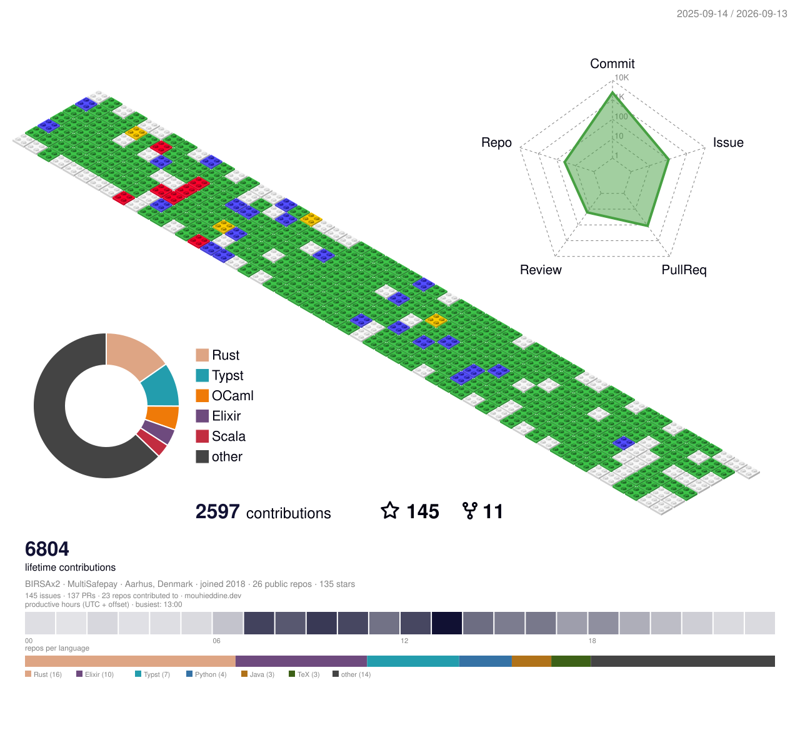

  <picture>
    <source media="(prefers-color-scheme: dark)" srcset="profile-3d-contrib/profile-gitblock-dark.svg">
    
  </picture>

 

<h1 align="center">Mouhieddine Sabir</h1>

Backend Engineer · MSc Computer Science @ Aarhus University

  <a href="https://mouhieddine.dev">mouhieddine.dev</a>
  &nbsp;·&nbsp;
  <a href="https://www.linkedin.com/in/mouhieddine/">LinkedIn</a>
  &nbsp;·&nbsp;
  <a href="mailto:me@mouhieddine.dev">me@mouhieddine.dev</a>

 

### About

Backend Engineer at **MultiSafepay** working on payment infrastructure, transaction flows, event-driven pipelines, and financial reconciliation.
Currently pursuing an **MSc in Computer Science** at Aarhus University, specialising in Software Foundations & Technology.
I gravitate toward systems programming, distributed systems, compilers, and type theory.

Full portfolio & interactive CV at [mouhieddine.dev](https://mouhieddine.dev).

### Tech Stack

 

 

 

